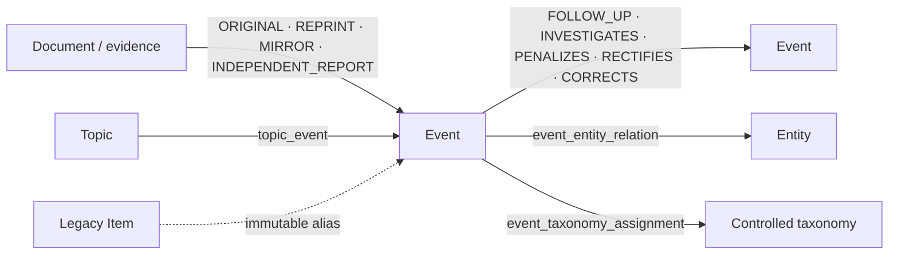

# 第 14 轮验收：Event 统一身份、关系拆分与 Item 兼容迁移

## 结论

第 14 轮工程切片完成。Event 是 Feed、搜索、日报、收藏、专题、下载引用和详情的唯一用户身份；Document 仅作为来源与证据。旧 Item 事实未删除，`item_id -> event_id` 绑定不可变，旧页面只执行 308，旧读取 API 返回弃用元数据，旧 Item 收藏写接口返回 410。未配置生产 Sunset 日期，响应不发送 `Sunset`。

这不改变第 11 轮生产证据仍为 `BLOCKED` 的结论，也不代表 23 条待人工确认的来源角色已被猜测完成。

## 迁移不变量与回滚

- 每个已发布 Item 必须解析到且只解析到一个稳定 Event；无法确定身份时进入 `event_migration_blocker`，不得创建 `PROVISIONAL_EVENT`。
- `event_type` 必填且无数据库默认值：八类 Item 显式映射为数字化项目、研究成果、产品发布或法规变化；只有安全案例映射为安全事故。
- 精确、无硬冲突的身份规则才可自动建立一对一身份；模糊匹配只保存候选、特征、硬冲突和规则版本，`auto_merge=false` 由数据库约束固定。
- Item 绑定只允许追加，更新和删除均由触发器拒绝；合并以旧 Event 的 canonical redirect 表达，拆分以原 Event 落地页和子 Event 列表表达。
- 发布、合并、拆分和回滚均经 `PublicationService`、复核人职责分离和追加式审计；旧 ID、发布修订和新增 Event 事实不被回滚删除。
- 应用回滚只需部署 consumer switch 前版本；expand 列和新增 Event 事实保留。数据库 downgrade 仅用于无 Round14 事实的验证环境，有绑定、成员关系或新生命周期事实时会拒绝降级。

执行顺序是 `expand -> shadow backfill -> parity check -> single consumer switch -> compatibility observation -> later cleanup`。本轮没有 cleanup，也没有删除 Item 表、旧事实或兼容读取接口。

## 关系职责



`event_relation` 只允许 Event 生命周期关系；实体、主题、来源角色和受控分类分别进入独立表。同一事故的初报、续报、调查、处罚和整改保留独立 Document，通过成员关系与生命周期关系连接，不按重复删除。

## 类型映射和身份边界

| 旧 Item 类型 | 显式 Event 类型 |
| --- | --- |
| `DIGITAL_CASE` | `DIGITAL_PROJECT` |
| `JOURNAL_PAPER` | `RESEARCH_RESULT` |
| `SOFTWARE_PRODUCT` | `PRODUCT_RELEASE` |
| `IOT_PRODUCT` | `PRODUCT_RELEASE` |
| `LOW_ALTITUDE_EQUIPMENT` | `PRODUCT_RELEASE` |
| `AI_EQUIPMENT` | `PRODUCT_RELEASE` |
| `SAFETY_REGULATION` | `REGULATION_CHANGE` |
| `SAFETY_CASE` | `SAFETY_INCIDENT` |

规范化权威外部标识、同源文号/标准号、DOI 和受约束内容哈希可形成确定性身份。标题相似、向量相似、模型判断和存在硬冲突的规则只形成候选，不能自动合并。

## 真实回填与对账

本地验收库运行 `round14-event-unification-v1`，run id 为 `019f663a-9442-749e-8070-79f33c816a77`，状态为 `NEEDS_REVIEW`，原因仅为来源角色需要人工确认。

| 指标 | 结果 |
| --- | ---: |
| Item / 已发布 Item | 46 / 23 |
| Event | 64 |
| 不可变 Item alias | 32 |
| Document-Event membership | 23 |
| 已发布 Item 缺失 Event 身份 | 0 |
| 已发布身份迁移成功率 | 23/23，100% |
| consumer parity differences | 0 |
| search/daily/saved/collection/feedback 行数 | 0/0/0/0/0 |
| 来源角色人工阻断 | 23 |

消费者表在本地验收数据中为空，因此迁移数和差异均为 0；真实 PostgreSQL 测试另行构造引用，验证 event_id 外键、ACL、revision 和用户引用。库中另外存在 32 个第 13 轮 downgrade/re-upgrade 历史留下的无 Item Event 事实；本轮遵守“不删除新增 Event 事实”，没有清理它们，后续 cleanup 必须独立审批。

### 人工迁移清单

下列记录已获得稳定 Event 身份，但 `document_event_membership.source_role` 不可由现有证据确定，统一以 `SOURCE_ROLE_REQUIRES_REVIEW` 阻断，不猜测 `ORIGINAL/REPRINT/MIRROR/INDEPENDENT_REPORT`：

```text
019f5e57-9195-7578-bd6e-ba6141b29c03
019f5e84-b4df-7fc9-8451-1a3ebcfa7384
019f5e96-0b16-7775-bdc5-8668f5056ded
019f5f15-fcb0-7c0c-9176-23caebbd38c3
019f5f1c-e194-7846-8954-a4278ceca7ae
019f5f20-5b7c-7cc4-a06d-e1448acbc73c
019f5f21-bff0-7572-9141-9979d8644073
019f5f57-1c21-7889-9a3c-7facf56a8c2b
019f5f57-289f-792d-badb-ce83c7ee8b09
019f5f5e-9d64-746c-96d6-081858f28005
019f5f61-6202-7778-a49d-c91e02d88611
019f5f61-6cef-7d8a-9835-0bc06a9755bd
019f5f62-3dcf-72ac-b129-8e83b791e0b3
019f5f62-4a07-7fef-b201-4ca06a218542
019f5f70-c7e2-7b8a-85ed-d589fb30eadf
019f5f71-29f8-7445-a547-9623263a4df8
019f5f83-a850-7260-9e72-15b497efe249
019f5f84-026f-77aa-a315-ad93d4d11d25
019f5fdc-0940-7822-8a43-7e6d0900eaa3
019f5fdc-6492-7447-85b2-657a8928818c
019f5fdf-751a-77af-8fd5-727c9948edb7
019f5ff0-b6cf-7098-a56a-baa7f85cfa81
019f5ff5-6a07-7716-835c-551076e1d299
```

## API 与重定向证据

旧读取 API 实测：

```http
GET /api/v1/items/019f5e57-9195-7578-bd6e-ba6141b29c03
HTTP/1.1 200 OK
Deprecation: @1784073600
Link: </api/v1/events/019f65e9-53db-7e8d-adf6-d827b254fd06>; rel="successor-version", </docs/compatibility/item-event>; rel="deprecation"; type="text/html"
```

未配置 `ITEM_API_SUNSET_AT`，所以没有 `Sunset`。旧收藏写接口返回 `410 Gone` 和相同弃用元数据。新接口以 Event 为键：

```http
GET /api/v1/events/019f65e9-53db-7e8d-adf6-d827b254fd06
HTTP/1.1 200 OK

{"id":"019f65e9-53db-7e8d-adf6-d827b254fd06","event_type":"REGULATION_CHANGE","event_status":"ACTIVE","event_version":1,...}
```

页面实测：

```http
GET /items/019f5e57-9195-7578-bd6e-ba6141b29c03
HTTP/1.1 308 Permanent Redirect
Location: /events/019f65e9-53db-7e8d-adf6-d827b254fd06
```

旧页面没有第二套详情渲染。Feed、搜索、日报、收藏、专题和卡片统一输出/链接 `event_id`；兼容契约中的旧字段仅为应用回滚窗口保留。

## 观测指标

新增迁移成功/阻断、consumer parity differences、alias resolution/loop、模糊候选积压和 identity rollback 计数器。回填任务按版本、checkpoint 和批次运行，幂等且可断点恢复，不在 Alembic 事务中处理无界数据。

## 门禁结果

| 门禁 | 结果 |
| --- | --- |
| Round 13 关键门禁（改动前） | 通过 |
| `make phase2-round14-test` | 21 passed；真实 PostgreSQL；`0013 -> 0014 -> 0013 -> 0014` |
| `make lint` / `make typecheck` | 通过 |
| `make test` | Python 514 passed、25 skipped；UI 53；Web 71（最终全局复验见提交记录） |
| `make contract-test` | 60 passed，生成物可复现 |
| `make security-check` | 通过；无 high/critical |
| `make fixture-replay` | 164 passed；Round09 eval 通过 |
| `make quality-gate` | 通过 |
| `make web-e2e` | 42 passed |
| `make web-a11y` | 13 passed |

实现提交与最终验收提交哈希在本文件最后一次提交中记录；验收前工作树基线为 `0068921d75c190c1c204bc8d8428036de85361cb`，开始时工作树干净。
