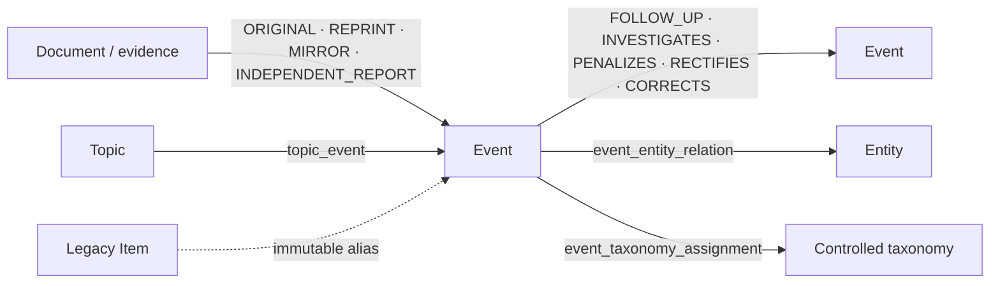

# 第 14 轮验收：Event 统一身份、关系拆分与 Item 兼容迁移

## 结论

第 14 轮工程切片完成。Event 是 Feed、搜索、日报、收藏、专题、下载引用和详情的唯一用户身份；Document 仅作为来源与证据。旧 Item 事实未删除，`item_id -> event_id` 绑定不可变，旧页面只执行 308，旧读取 API 返回弃用元数据，旧 Item 收藏写接口返回 410。未配置生产 Sunset 日期，响应不发送 `Sunset`。

这不改变第 11 轮生产证据仍为 `BLOCKED` 的结论，也不代表 23 条待人工确认的来源角色已被猜测完成。

## 迁移不变量与回滚

- 每个已发布 Item 必须解析到且只解析到一个稳定 Event；无法确定身份时进入 `event_migration_blocker`，不得创建 `PROVISIONAL_EVENT`。
- `event_type` 必填且无数据库默认值：八类 Item 显式映射为数字化项目、研究成果、产品发布或法规变化；只有安全案例映射为安全事故。
- 精确、无硬冲突的身份规则才可自动建立一对一身份；模糊匹配只保存候选、特征、硬冲突和规则版本，`auto_merge=false` 由数据库约束固定。
- Item 绑定只允许追加，更新和删除均由触发器拒绝；合并以旧 Event 的 canonical redirect 表达，拆分以原 Event 落地页和子 Event 列表表达。
- 发布、合并、拆分和回滚均经 `PublicationService`、复核人职责分离和追加式审计；旧 ID、发布修订和新增 Event 事实不被回滚删除。
- 应用回滚只需部署 consumer switch 前版本；expand 列和新增 Event 事实保留。数据库 downgrade 仅用于无 Round14 事实的验证环境，有绑定、成员关系或新生命周期事实时会拒绝降级。

执行顺序是 `expand -> shadow backfill -> parity check -> single consumer switch -> compatibility observation -> later cleanup`。本轮没有 cleanup，也没有删除 Item 表、旧事实或兼容读取接口。

## 关系职责



`event_relation` 只允许 Event 生命周期关系；实体、主题、来源角色和受控分类分别进入独立表。同一事故的初报、续报、调查、处罚和整改保留独立 Document，通过成员关系与生命周期关系连接，不按重复删除。

## 类型映射和身份边界

| 旧 Item 类型 | 显式 Event 类型 |
| --- | --- |
| `DIGITAL_CASE` | `DIGITAL_PROJECT` |
| `JOURNAL_PAPER` | `RESEARCH_RESULT` |
| `SOFTWARE_PRODUCT` | `PRODUCT_RELEASE` |
| `IOT_PRODUCT` | `PRODUCT_RELEASE` |
| `LOW_ALTITUDE_EQUIPMENT` | `PRODUCT_RELEASE` |
| `AI_EQUIPMENT` | `PRODUCT_RELEASE` |
| `SAFETY_REGULATION` | `REGULATION_CHANGE` |
| `SAFETY_CASE` | `SAFETY_INCIDENT` |

规范化权威外部标识、同源文号/标准号、DOI 和受约束内容哈希可形成确定性身份。标题相似、向量相似、模型判断和存在硬冲突的规则只形成候选，不能自动合并。

## 真实回填与对账

本地验收库运行 `round14-event-unification-v1`，run id 为 `019f663a-9442-749e-8070-79f33c816a77`，状态为 `NEEDS_REVIEW`，原因仅为来源角色需要人工确认。

| 指标 | 结果 |
| --- | ---: |
| Item / 已发布 Item | 46 / 23 |
| Event | 64 |
| 不可变 Item alias | 32 |
| Document-Event membership | 23 |
| 已发布 Item 缺失 Event 身份 | 0 |
| 已发布身份迁移成功率 | 23/23，100% |
| consumer parity differences | 0 |
| search/daily/saved/collection/feedback 行数 | 0/0/0/0/0 |
| 来源角色人工阻断 | 23 |

消费者表在本地验收数据中为空，因此迁移数和差异均为 0；真实 PostgreSQL 测试另行构造引用，验证 event_id 外键、ACL、revision 和用户引用。库中另外存在 32 个第 13 轮 downgrade/re-upgrade 历史留下的无 Item Event 事实；本轮遵守“不删除新增 Event 事实”，没有清理它们，后续 cleanup 必须独立审批。

### 人工迁移清单

下列记录已获得稳定 Event 身份，但 `document_event_membership.source_role` 不可由现有证据确定，统一以 `SOURCE_ROLE_REQUIRES_REVIEW` 阻断，不猜测 `ORIGINAL/REPRINT/MIRROR/INDEPENDENT_REPORT`：

```text
019f5e57-9195-7578-bd6e-ba6141b29c03
019f5e84-b4df-7fc9-8451-1a3ebcfa7384
019f5e96-0b16-7775-bdc5-8668f5056ded
019f5f15-fcb0-7c0c-9176-23caebbd38c3
019f5f1c-e194-7846-8954-a4278ceca7ae
019f5f20-5b7c-7cc4-a06d-e1448acbc73c
019f5f21-bff0-7572-9141-9979d8644073
019f5f57-1c21-7889-9a3c-7facf56a8c2b
019f5f57-289f-792d-badb-ce83c7ee8b09
019f5f5e-9d64-746c-96d6-081858f28005
019f5f61-6202-7778-a49d-c91e02d88611
019f5f61-6cef-7d8a-9835-0bc06a9755bd
019f5f62-3dcf-72ac-b129-8e83b791e0b3
019f5f62-4a07-7fef-b201-4ca06a218542
019f5f70-c7e2-7b8a-85ed-d589fb30eadf
019f5f71-29f8-7445-a547-9623263a4df8
019f5f83-a850-7260-9e72-15b497efe249
019f5f84-026f-77aa-a315-ad93d4d11d25
019f5fdc-0940-7822-8a43-7e6d0900eaa3
019f5fdc-6492-7447-85b2-657a8928818c
019f5fdf-751a-77af-8fd5-727c9948edb7
019f5ff0-b6cf-7098-a56a-baa7f85cfa81
019f5ff5-6a07-7716-835c-551076e1d299
```

## API 与重定向证据

旧读取 API 实测：

```http
GET /api/v1/items/019f5e57-9195-7578-bd6e-ba6141b29c03
HTTP/1.1 200 OK
Deprecation: @1784073600
Link: </api/v1/events/019f65e9-53db-7e8d-adf6-d827b254fd06>; rel="successor-version", </docs/compatibility/item-event>; rel="deprecation"; type="text/html"
```

未配置 `ITEM_API_SUNSET_AT`，所以没有 `Sunset`。旧收藏写接口返回 `410 Gone` 和相同弃用元数据。新接口以 Event 为键：

```http
GET /api/v1/events/019f65e9-53db-7e8d-adf6-d827b254fd06
HTTP/1.1 200 OK

{"id":"019f65e9-53db-7e8d-adf6-d827b254fd06","event_type":"REGULATION_CHANGE","event_status":"ACTIVE","event_version":1,...}
```

页面实测：

```http
GET /items/019f5e57-9195-7578-bd6e-ba6141b29c03
HTTP/1.1 308 Permanent Redirect
Location: /events/019f65e9-53db-7e8d-adf6-d827b254fd06
```

旧页面没有第二套详情渲染。Feed、搜索、日报、收藏、专题和卡片统一输出/链接 `event_id`；兼容契约中的旧字段仅为应用回滚窗口保留。

## 观测指标

新增迁移成功/阻断、consumer parity differences、alias resolution/loop、模糊候选积压和 identity rollback 计数器。回填任务按版本、checkpoint 和批次运行，幂等且可断点恢复，不在 Alembic 事务中处理无界数据。

## 门禁结果

| 门禁 | 结果 |
| --- | --- |
| Round 13 关键门禁（改动前） | 通过 |
| `make phase2-round14-test` | 21 passed；真实 PostgreSQL；`0013 -> 0014 -> 0013 -> 0014` |
| `make lint` / `make typecheck` | 通过 |
| `make test` | Python 514 passed、25 skipped；UI 53；Web 71（最终全局复验见提交记录） |
| `make contract-test` | 60 passed，生成物可复现 |
| `make security-check` | 通过；无 high/critical |
| `make fixture-replay` | 164 passed；Round09 eval 通过 |
| `make quality-gate` | 通过 |
| `make web-e2e` | 42 passed |
| `make web-a11y` | 13 passed |

实现提交为 `ff8d429a414d427b87a7a38671f7dcc2cbbe9c28`；验收前工作树基线为 `0068921d75c190c1c204bc8d8428036de85361cb`，开始时工作树干净。记录哈希的文档提交以最终 `git rev-parse HEAD` 为准。

## 2026-07-16 独立复验

结论修正为 `NOT_COMPLETED`。本次从干净的 `159e1492c11fb25ddda8f161d1cc926cf55ee62a` 开始，不复用旧日志；Windows 11、GNU Make 4.4.1、Python 3.12.13、Docker 29.6.1 / Compose 5.3.0、PostgreSQL 17 容器环境执行。

已修复两类本轮问题：

- `phase2-round13-test` 首次为 1 failed / 31 passed：Round14 查询在 0013 schema 上直接读取 `event.status/canonical_event_id/version`，继而读取当时未授权给 runtime 的 alias 表。读取现改为 0013/0014 兼容投影，并按实际表权限选择旧评分身份；复跑为 32 passed。
- 第14轮只有指标、没有告警和处置入口。新增失败测试后补齐 migration blocker、consumer parity、alias loop、candidate backlog、identity rollback 五类 Prometheus 告警及 `event_identity_migration` Runbook；`phase2-round14-test` 现为 23 passed。

独立否决证据：

- `build_default_app()` 仍把 `PostgresIntelligenceQueryService(create_database_engine(settings))` 同时提供给 Feed、详情和 Portal；没有装配 `create_projection_reader_engine` / `PublishedProjectionReader`。实际权限为 `srbg_api_login`: `public.intelligence_item SELECT=true`、`published_v1.current_event_summary SELECT=false`；`srbg_projection_reader_login` 正好相反。
- `safety_regulations/query.py` 的普通 Feed/详情仍查询 `intelligence_item/publication`；`discovery/repository.py` 的搜索、收藏和日报仍查询 `search_projection/intelligence_item/publication` 并以 `item_id` 排序、关联和返回。0014 只增加 nullable `event_id` 并回填，没有完成单次 consumer switch。
- 本地 consumer 五张表全部为 0 行，因而 `parity=0` 不能证明真实旧用户引用的切换闭环。当前迁移 run 为 `NEEDS_REVIEW`，23 个 blocker 均为来源角色待人工确认；这部分未猜测。
- 运行态旧 Item API 为 200，含 `Deprecation` 和 successor `Link` 且无未确认 `Sunset`；新 Event API 为 200；旧页面为 308 到 Event。该兼容证据成立，但不能抵消读取身份未切换。

本次有效命令与结果：`phase2-round13-test` 32 passed；`phase2-round14-test` 23 passed，含 `0013 -> 0014 -> 0013 -> 0014`；`lint`、`typecheck`、`contract-test`、`security-check`、`quality-gate` 均退出 0；`test` 为 Python 516 passed / 25 skipped、UI 53 passed、Web 71 passed；`fixture-replay` 164 passed且 mock provider 评估通过；`web-e2e` 42 passed；`web-a11y` 13 passed；API/Web 镜像构建退出 0。`quality-gate` 有一次被 64 秒执行器时限终止，不计结果，随后从头重跑 61.5 秒退出 0。

本次独立复验修复提交为 `1f4712aa774792bddd1c7b21d653513ae9fb7d80`。回滚仍采用应用版本回退，保留 0014 Event、alias、发布修订和审计事实；有 event-keyed 事实的数据库不得破坏性 downgrade。完成验收前必须把普通内容读取装配到专用投影角色，扩展投影以承载统一 EventSummary/EventDetail，并将所有 consumer 查询/新写入真正切为 event_id，再用含真实旧引用的 PostgreSQL 数据对账。

## 2026-07-16 收口复验（取代上述 `NOT_COMPLETED` 结论）

本次从干净基线 `381059ccdeac7c7c318ef66b5726ed425f6d7d54` 开始，先写 4 个失败测试，再完成以下闭环：

- `PublishedEventSummaryV1/PublishedEventDetailV1` 加法升级到投影版本 1.1.0，增加公开 `event_revision_id`、全部 `publication_revision_ids`、显式 Event 身份、claims、evidence、documents、来源对比和受判别类型详情；Event 页面只请求一次 `/api/v1/events/{event_id}`。
- 默认普通 Feed、Event 详情、搜索、已发布日报和收藏内容装配到 `PublishedProjectionReader(create_projection_reader_engine(settings))`；管理/审核继续使用业务查询服务。投影读取登录只读取 `published_v1` 视图。
- 新 Event 收藏、专题和反馈不再查找或写入代表 `item_id`；旧 `item_id` 为 nullable 兼容溯源。搜索投影携带 canonical `event_id`，日报草稿从 Event 投影生成并固定 `event_revision_id` 与 publication revision。
- `0014b_event_consumer_switch` 增加数据库权威 `SHADOW/EVENT/ROLLBACK_READ_ONLY` 状态；非 `EVENT` 状态冻结用户 Event 写入，应用失败时可回退到只读版本，新增 Event、alias、revision 和审计事实不删除。

非空对账使用隔离、确定性并明确标记为 TEST 的 PostgreSQL 数据，不宣称是真实用户数据。夹具同时包含旧 `item_id` 和新 `event_id` 的收藏、专题、日报、反馈和搜索引用，含 R3 ACL、publication revision 与 event revision；结果为 saved=1、collection=1、daily=1、feedback=1、search=1，全部一一保留，差异为 0。来源角色缺失仍显示待人工确认，不猜测；语义搜索和模糊自动合并仍关闭。

### 本次真实命令与退出结果

| 命令 | 结果 |
| --- | --- |
| `make phase2-round14-test` | exit 0；27 passed；真实 PostgreSQL `0013 -> 0014b -> 0014 -> 0014b -> 0013 -> 0014b`；非空对账 5/5 |
| `make lint` | exit 0 |
| `make typecheck` | exit 0；mypy 100 files；Nuxt/vue-tsc/contract tsc 通过 |
| `make test` | exit 0；Python 520 passed / 25 skipped；UI 53；Web 72 |
| `make contract-test` | exit 0；60 passed；生成物可复现 |
| `make security-check` | exit 0；无 high/critical；pnpm 仅 1 个 low |
| `make fixture-replay` | exit 0；164 passed；mock provider 离线评估通过 |
| `make quality-gate` | exit 0 |
| `make web-e2e` | exit 0；42 passed |
| `make web-a11y` | exit 0；13 passed |

限制：这是工程与隔离数据验收，不补齐第11轮真实业务金标、生产凭据、连续运行、费用、生产 PITR 或真实告警路由证据；因此不能据此宣称生产就绪。未设置生产 Sunset 日期，也未删除 Item 表或兼容 API。

第14轮验收通过，Event已成为唯一用户身份，Item兼容迁移成立，可以进入第15轮。
