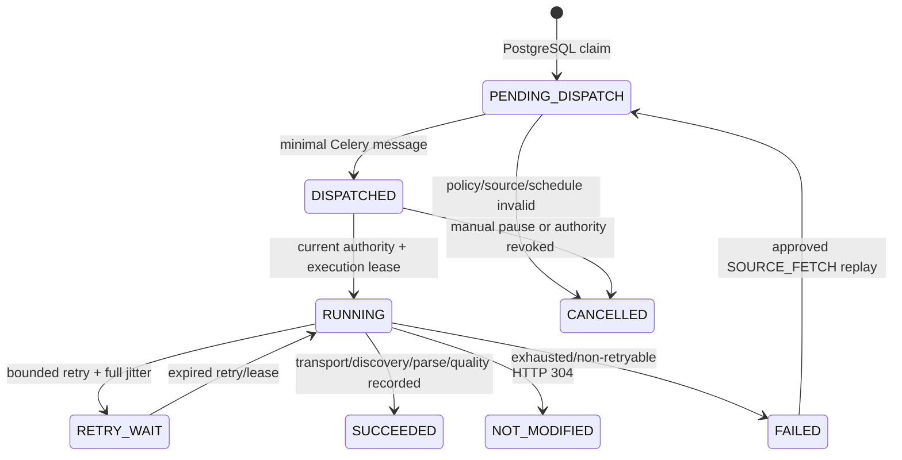

# 第 16 轮验收：PostgreSQL 权威调度、来源健康与安全重放

## 结论

验收时间：2026-07-16（Asia/Shanghai）。基线为 `518144f38a00ef072eead4aa7cd228a55f8d0337`，实现提交为 `c32fb3d88ec7c13c8ff3e93fc71cf0e2815bf058`。开始时工作树 clean，未发现需保留的用户未提交改动。

第16轮验收通过，数据库权威调度、来源健康和安全重放成立，可以在获得真实来源授权后进入第17轮。

独立验收结论：当前轮验收通过，可以进入下一轮。

## 不可破坏不变量

1. PostgreSQL 是计划、运行、租约、重试、熔断、预算、失败和重放的唯一业务事实；Redis 只是队列/缓存。
2. 只有 ACTIVE 来源、ACTIVE 计划、当前 APPROVED 且未过期策略、VALID 配置、有效生产审批、剩余预算和可通过熔断门的来源可领取。
3. 调度领取使用单个 PostgreSQL 事务和 `FOR UPDATE SKIP LOCKED`；一个到期计划只产生一个权威 `fetch_run`。
4. Celery 消息严格为 `{"source_id":"<uuid>","run_id":"<uuid>"}`；不含 URL、正文、密钥、Cookie、令牌、模型输入或个人信息。
5. Worker 在执行租约之前重读当前来源、计划、策略、配置、审批、预算和熔断；失效的未租赁运行收口为 `CANCELLED/AUTHORIZATION_REVOKED`。
6. 重复 Celery 投递只有一个执行租约持有者；租约过期可恢复同一 `run_id`。Redis 清空后从 PostgreSQL 重建消息，不新建业务运行。
7. 失败任务仅保存可验证权威引用、处理版本、错误分类和幂等键。不能证明幂等边界或当前证据的记录停止为 `NON_REPLAYABLE/BLOCKED`。
8. 保留删除先检查 legal hold 和唯一已发布证据；必要时先经唯一 `PublicationService` 失效并确认投影，然后擦除对象。仅留哈希、大小、MIME、引用、原因和审计。

## 状态图

计划状态为 `ACTIVE/PAUSED/RETIRED`；熔断状态为 `CLOSED/OPEN/HALF_OPEN`。连续 5 个耗尽重试且计入熔断的失败打开 30 分钟熔断；半开仅允许一个探测，成功关闭，失败再打开。人工暂停始终优先。

## 需求—实现—测试—证据矩阵

| 需求 | 实现 | 测试/证据 |
|---|---|---|
| PostgreSQL 计划与并发领取 | `0016_scheduling_health_replay.py`、`PostgresSchedulingService` | 隔离 PostgreSQL 双连接并发领取、租约过期恢复；R16 专项 25/25 |
| 最小消息与重复投递 | `build_fetch_message`、Celery Beat/路由、执行租约 | 消息精确相等断言；真实 Celery 独立队列投递两次，`attempt_count=1` |
| Redis 非事实源 | `pending_messages()` 从 `fetch_run` 重建 | 实际 Redis DB 15 `FLUSHDB` 后权威消息仍由 PostgreSQL 返回 |
| 退避/熔断/失败分类 | 可注入随机源的全抖动指数退避、`record_outcome` | 304、429、5xx、timeout、DNS、parse、object storage、database 参数化测试 |
| 假成功与分层健康 | `HealthObservation/evaluate_health`、snapshot/anomaly 表 | 零发现、freshness、长度、必填、DOM、重复率、积压联合断言 |
| 安全失败与重放 | `failures.py`、`replays.py`、重放租约 | 旧 Celery ID-only 不可重放；AI 关闭阻断；过期租约恢复；无 Payload 断言 |
| 保留与发布失效顺序 | `RetentionService`、`retention_execution`、S3 `erase` | legal hold 不删；唯一证据按 invalidate→confirm→erase→record 严格断言 |
| 管理 API/UI | schedule GET/PUT、health/replay GET、OperationsDashboard/来源详情 | RBAC/step-up/严格契约；Web 87/87；E2E 46/46；a11y 15/15 |
| 观测与恢复 | 低基数 Prometheus、告警、Grafana、Runbook | 指标禁止 source_id/URL 标签；5 类告警与 6 类 Runbook marker 自动测试 |

## 故障矩阵与恢复结果

| 故障 | 状态/重试 | 恢复证据 |
|---|---|---|
| 304 | `NOT_MODIFIED`，不计熔断 | 分类单测 |
| 429 + Retry-After | `RETRY_WAIT`，服从有界上游等待，不计熔断 | 上限 3600s 断言 |
| 5xx/超时/DNS | 有界重试，耗尽后计熔断 | 分类+退避断言 |
| 解析/对象存储/数据库 | 保留 raw-first/权威运行，有界重试 | 故障分类和保留协作者测试 |
| Worker 崩溃/重复投递 | 执行租约，过期重获，内容幂等 | PostgreSQL 租约恢复+真实 Celery 双投递 |
| Redis 丢失 | 从 PostgreSQL `PENDING_DISPATCH/DISPATCHED` 重建 | 实际 `FLUSHDB` 后返回同一 run |
| 策略过期/人工暂停 | 执行前拒绝并 `CANCELLED` | 领取后暂停的数据库集成测试 |
| 对象存储不可用 | 不删数据库事实，记录有界失败 | Runbook `object_storage_unavailable` |
| 保留误操作 | legal hold/唯一证据阻断，先失效投影 | Runbook `retention_mistake`，服务顺序测试 |

## 指标与告警样例

- `srbg_schedule_dispatch_delay_seconds{outcome="DISPATCHED"}`
- `srbg_source_freshness_seconds{status="VIOLATED"}`
- `srbg_fetch_backlog_age_seconds{state="RETRY_WAIT"}`
- `srbg_fetch_failures_total{kind="HTTP_5XX"}`
- `srbg_source_parse_quality_basis_points{status="DEGRADED"}`
- `srbg_source_circuit_state{state="OPEN"}`
- `srbg_replay_results_total{kind="PARSER",outcome="FAILED"}`
- `srbg_retention_results_total{outcome="BLOCKED_LEGAL_HOLD"}`
- `srbg_source_slo_violations_total{dimension="ZERO_DISCOVERY_STREAK"}`

标签值均来自受控枚举，不包含 `source_id`、URL、查询密钥或正文。告警覆盖 `SourceFalseSuccess`、`SourceFreshnessSLOViolation`、`FetchQueueBacklog`、`SafeReplayBlocked`和 `RetentionExecutionFailure`。

## 本次实际命令与退出结果

| 命令 | 本次结果 |
|---|---|
| `make phase2-round15-test` | 0；351 Python/契约、84 Web 单测、3 E2E、1 a11y（R16 修改前基线） |
| `make phase2-round16-test` | 0；25 隔离后端/基础设施测试，87 Web 单测 |
| `make lint` | 0 |
| `make typecheck` | 0；mypy 109 source files，Nuxt/Vue/TS strict 通过 |
| `make test` | 0；827 passed/29 skipped，UI 53，Web 87 |
| `make contract-test` | 0；生成可复现，75 passed |
| `make security-check` | 0；pip 无已知漏洞，pnpm 1 low，Trivy HIGH/CRITICAL 0 |
| `make fixture-replay` | 0；349 passed，mock 评估 10000 bps，费用 0 |
| `make quality-gate` | 0；内部重跑 lint/typecheck/test/contract/security |
| `make web-e2e` | 0；46 passed |
| `make web-a11y` | 0；15 passed |

所有等待型状态机测试使用显式 `now`/过期时间推进；真实 Celery 工作线程只用事件等待两条已投递消息完成，没有用长时 `sleep` 冒充连续运行。

## 验收环境

- Windows，工作区 `D:\CodexProjects\srbg-intelligence-platform`
- Python 3.12.13，Node.js 24.14.0，pnpm 11.12.0，Celery 5.6.3
- Docker 29.6.1，Compose 5.3.0
- PostgreSQL 17.10，Redis 7.4.7，隔离 MinIO bucket
- Alembic：`0015b_source_center_convergence -> 0016_scheduling_health_replay -> 0015b -> 0016`，存在 R16 事实时降级拒绝

## 显式暂存文件

实现提交使用逐路径 `git add -- <path...>`，未使用 `git add .`、`git add -A`、stash、reset、checkout 或 clean。暂存范围为：

- 根目录：`README.md`、`CHANGELOG.md`、`Makefile`
- 迁移：`apps/api/migrations/versions/0016_scheduling_health_replay.py`
- API：`document_vault/storage.py`、`logging.py`、`observability.py`、`operations/{api,failures,replays,service}.py`、`retention/{__init__,service}.py`、`scheduling/{__init__,domain,service}.py`
- API 测试：13 个旧迁移 head 断言文件与 `test_round16_{failure_records,migration,operations_api,replay_integration,retention,scheduling,scheduling_integration}.py`
- Worker：`apps/worker/src/srbg_worker/app.py`、`apps/worker/tests/{test_worker,test_round16_worker}.py`
- Web：`OperationsDashboard.vue`、`admin/source-health.vue`、`admin/sources/[id].vue`、`round16-operations-ui.test.ts`、`e2e/round16-source-health.spec.ts`
- 契约：`models.py`、`__init__.py`、`export.py`、`test_export.py`、`generate-types.mjs`，以及 5 个 JSON Schema 和 5 个 TypeScript 生成文件/索引
- 基础设施：`prometheus/rules.yml`、`grafana/dashboards/source-health.json`、`docs/operations/runbooks.md`
- 验证：`scripts/run_isolated_integration.py`、`scripts/verify_round16_migration.py`、`tests/infrastructure/test_round16_{delivery,observability}.py`

## 已知限制与剩余风险

1. 没有激活或联网任何真实来源；隔离 Fixture/故障注入、实际 Redis/Celery 本地证据不是真实来源连续运行证据。
2. AI 重放保持关闭；没有启用模型、语义搜索、邮件或企业微信。
3. 没有验证生产告警路由、生产对象存储故障或人员值守响应；这些仍受第 11 轮生产证据 `BLOCKED` 约束。
4. 真实来源的 SLO/计划必须在获得 robots、条款、授权、允许频率和接入能力证据后设定，不得为 15 分钟目标强行轮询。
5. 开发持久卷曾保留早期 `failed_task(target_id)` 形状；0016 已用结构探测修复为兼容形状，并将无法验证的旧任务标记 `LEGACY_TASK_ID_ONLY`。新空库与该漂移库均已实测升级。
