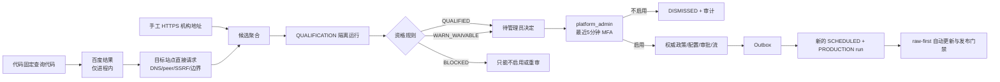

# 自动化来源治理优化切片验收记录

## 结论

验收日期：2026-07-17（Asia/Shanghai）。实现基线提交为 `003af8bf3a2ad1dade9dd0238607fb78e80aacd4`，工作分支为 `codex/round-10-feed-search-daily`；开始实现前工作树为 clean，本记录只描述本轮实际代码、迁移、契约、测试和默认配置。

本切片完成了“自动发现候选 → 目标站点直接核验 → 隔离资格审查 → `platform_admin` 单次启用/不启用 → 新生产采集”的纵向工程链路。管理员不再需要为自动候选依次手工创建政策、连接器配置、试运行和生产审批；这些权威事实由服务端在当前资格包与最终决定的同一受控事务中生成。搜索供应商、模型、客户端、CSV 和 Worker 均不能直接授予 ACTIVE。

本结论是**默认关闭的工程能力已交付**，不是“真实联网或生产可用已批准”：

- `SRBG_SOURCE_DISCOVERY_ENABLED=false`、`SRBG_SOURCE_QUALIFICATION_ENABLED=false`、`SRBG_BAIDU_SEARCH_ENABLED=false`，API key 为空；本轮没有执行真实百度请求，也没有因本切片启用真实来源。
- 自动定时发现首版只有百度搜索；Directory、RSS、Sitemap、Outbound Link 仅有候选渠道契约，尚无相应自动发现调度器。
- 自动连接器是通用 `LIST_DETAIL` V1，不保证适合每个机构站点；来源流动作只有服务端投影建议，尚无独立的自动化来源流写 API。
- 第17轮20来源真实试运行继续为 `BLOCKED`。本切片不构成20源审批、168小时观察窗口、真实证据导出、生产告警路由或阶段晋级证据。

## 第一性原理推导

不可再分的目标是“尽可能快地增加有价值来源，同时不让来源数量增长突破法律、安全、成本和证据边界”。由此得到四个必须同时成立的事实：

1. 发现只是在降低候选搜寻成本，不是授权。搜索命中不能成为生产来源或发布证据。
2. 人工稀缺资源应只用于不可自动化的权威决定。机器可以采集和计算事实，最终风险接受必须由有权管理员完成。
3. 资格证据与生产证据目的不同。前者证明“是否可接入”，后者证明“本次发布内容来自哪里”；混用会造成执行域和证据污染。
4. 自动更新必须由当前授权驱动。一次批准不能绕过后续政策、配置、预算、熔断和内容发布门禁。

因此实现不是放松为“自动批准”，而是把原来多步人工准入重构为服务端自动准备、一个人类决定点和持续自动复核：

## 实现范围

### 候选发现与分类

- `source_discovery.py` 把查询目录固定在代码中，覆盖12个工程行业：公路、桥梁、隧道、铁路、城市轨道交通、水利、市政、建筑、能源、港口航道、机场和综合交通；每个行业各有数字化与安全查询，共24个查询代码。
- 数字化范围为数字化转型案例、论文、软件/平台、物联网设备、低空设备、AI设备与应用；安全范围为安全规定、标准/指南、官方事故调查、通报、处罚和整改案例，未扩展到首期外的法规库、工法库、招标资讯或内部数据集成。
- Beat 每21600秒唤醒一次；Celery 消息只含 `query_code` 和 `discovery_run_id`。百度请求固定 `top_k=50`，每个查询最多直接探测20个不同机构 origin，不能从消息或管理 API 注入任意搜索词。
- 自动发现把页面 URL 规范化为无 query/fragment 的 HTTPS 机构 origin；只有目标站点直接响应通过安全探测后才调用数据库登记。候选按规范化 URL/证据聚合，重复出现追加 occurrence，不重复创建权威候选。
- 手工 HTTPS URL 通过同一 `register_discovered_source_candidate` 命令登记，随后自动请求首次资格审查；不是旧的人工多阶段审批快捷方式。

`DiscoveryChannel` 契约包含 `DIRECTORY/RSS/SITEMAP/OUTBOUND_LINK/MANUAL/BAIDU_SEARCH`，但本轮实际自动执行器只有 `BAIDU_SEARCH`，实际手工入口只有 `MANUAL`。现有六类声明式连接器能力不能被解释成六类自动候选发现器。

### 供应商瞬态边界

- 百度端点被钉死为 `https://qianfan.baidubce.com/v2/ai_search`，拒绝不同 host、path、port、userinfo、query、fragment 和重定向目标；JSON 请求使用 DNS 解析、全公网地址校验、实际 peer 固定、显式2秒默认超时和响应大小上限。
- 供应商返回在 `SearchResult(transient_response=true)` 中短暂解析；标题和摘要在适配器边界丢弃。固定查询目录保存在代码中，但单次查询记录、返回标题/摘要、响应体、API key 和 Authorization header 不进入候选表、对象存储、Celery 消息、任务结果或日志。
- 供应商 URL 也不是证据。Worker 使用共享 `ResilientHttpClient` 对目标站点再次执行 DNS/IP/peer、HTTPS、每跳重定向、机构边界、限速、超时和最大2 MiB限制，持久化只接受目标 origin、目标响应 SHA-256、材料指纹和服务端固定分类。
- 固定查询不含内部项目、人员或用户输入；“不持久化供应商材料”不代表供应商无法看到收到的固定查询，启用前仍需隐私和合同审批。

### 资格规则与隔离

资格运行的 Celery 消息只含 `qualification_run_id`。Worker 从 PostgreSQL 领取 `QUALIFICATION` 租约，从候选 canonical URL 开始直接探测，不接受供应商 payload 作为 gateway 输入。可保存的资格原始响应先经 ClamAV，使用 SHA-256 内容寻址写入私有 `qualification/sha256/...`；当规则要求 `TRANSIENT_METADATA_ONLY` 时不保存响应体。

| 事实 | 结果 | 管理员权限 |
| --- | --- | --- |
| robots/条款/版权明确允许，公网/边界/连接器/样本均通过 | `QUALIFIED` | 可单项启用；可进入全绿批量 |
| robots/条款/版权为 UNKNOWN、RESTRICTED 或 NOT_PRESENT | `WARN_WAIVABLE` | 只可逐项填写豁免；不能进入批量 |
| 原始证据禁止保存 | `WARN_WAIVABLE` + `TRANSIENT_METADATA_ONLY` | 激活命令仍要求 `PRIVATE_RAW_ALLOWED`，因此不能仅凭豁免进入生产采集 |
| 明确 robots/条款/版权阻断 | `BLOCKED` | 不得启用；可不启用或重新资格审查 |
| 登录、验证码、付费墙、非公网地址、越界重定向、连接器无效、零样本或零相关项 | `BLOCKED` | 不得启用；可不启用或重新资格审查 |

资格包保存规则版本、材料指纹、存储政策、证据捕获政策、分项检查、reason code、样本计数、SHA-256 和7天有效期。资格包是 append-only；候选只引用当前包。启用时同时比较当前包哈希、材料指纹和有效期，任一变化均返回冲突，不允许旧 WARN 豁免跨材料复用。

资格捕获与生产链路名义、数据库表和对象命名空间均隔离。激活 Outbox 必须新建不同的 `fetch_run.id`，其 `run_origin='SCHEDULED'`、`execution_domain='PRODUCTION'`；代码没有把 qualification capture 或 bundle 读取为生产 RawObject/Document 的入口。

### 管理员决定与后台

- `/api/v1/admin/source-candidates` 支持服务端 cursor、状态、资格结论、发现渠道、行业、内容域、语言和查询过滤；详情返回服务端 `available_actions`，浏览器不自行推导准入。
- `/api/v1/admin/source-streams` 展示已启用/历史来源流，`/api/v1/admin/source-attention` 展示开放或已确认异常；`/admin/sources?view=candidates|enabled|attention` 使用同一来源中心三工作区。
- `auditor` 只读；`source_admin` 和 `platform_admin` 可登记或重审；启用、不启用和批量决定只允许 `platform_admin`。
- 生产 OIDC 决定同时要求受信 `acr`、`amr=mfa` 和 `auth_time≤300s`。本地身份只在已有 demo/test 安全规则下使用本地 step-up，不能成为生产例外。
- 决定必须携带 `Idempotency-Key`，ENABLE 必须绑定当前资格包 SHA-256。数据库 SECURITY DEFINER 命令以请求哈希检查幂等冲突，并追加候选决定、来源治理决定、生命周期事件和哈希链审计。
- 全绿启用和不启用不要求管理员重复填写通用操作原因，客户端提交受控审计原因；WARN 仍必须逐条写安全、具体的豁免理由。BLOCK 不返回 ENABLE；不启用允许处理当前 BLOCK 包，也允许收口在生成包之前便失败的候选。批量启用限1—10项、同一规则版本、未过期且全为 QUALIFIED；整体预检先完成，执行按每项独立事务返回 APPLIED/CONFLICT。
- Web 收到陈旧资格409时只刷新候选一次，不自动重放管理员决定，避免把新证据误当成旧授权。

### 启用事务和自动更新

资格请求时先为候选准备保持 `CANDIDATE` 的来源、候选政策/配置、隔离 trial 和暂停计划，避免最终管理员再走多步表单。ENABLE 事务在当前资格包下生成新的批准政策、VALID 连接器配置、生产审批、ACTIVE 来源、ACTIVE 默认流/计划和 activation Outbox；提交人、规则评估者和最终管理员不能是同一主体。

Outbox Worker 重新检查 ACTIVE 来源/流/计划、当前政策与配置、有效生产审批和权限函数，然后创建新的生产 fetch run 并只投递 `source_id/run_id`。重复 Outbox 或 Celery 投递返回同一权威结果，不生成第二个业务运行。

生产采集复用 Round16/17 运行时：

- PostgreSQL 是计划、租约、预算、重试、熔断和运行状态的唯一事实；Redis 不是授权源。
- 每次物理 I/O 前重读来源、政策、配置、生产审批、允许域、计划、请求/字节预算和熔断；授权变化使运行取消/失败收口。
- 每个 host 的运行时连续5次失败打开30分钟熔断；连续3次零发现记录 `ZERO_DISCOVERY_STREAK`，区分“HTTP成功”和“发现成功”。
- 原始响应先保存，再解析/形成 Document；后续 accepted Claim/Evidence、R3/R4、Event 和 PublicationService 门禁均未被本切片绕过。自动启用不等于自动发布或进入 `/selected`。

## 数据库与权限

`0018_source_automation` 新增：

- `source_candidate`、`source_candidate_occurrence`；
- `source_qualification_run`、`source_qualification_capture`、`source_qualification_bundle`；
- `source_candidate_decision`、`source_stream`、`source_activation_outbox`；
- `source_provider_usage`。

Occurrence、capture、bundle 和 decision 使用不可变触发器；候选当前包通过外键绑定。迁移为已有来源回填 `DEFAULT` 流，状态为 `QUALIFIED`、规则为 `REQUALIFICATION_REQUIRED`，不会 grandfather 为本轮自动化 ACTIVE 授权。API/Worker 没有自动化表的宽泛写权限：管理员决定只经 SECURITY DEFINER 命令，Worker 仅获得 occurrence/capture/bundle 追加、资格/Outbox 租约和月度用量等必要权限；projection reader 无权读取自动化私有表。

激活命令把资格哈希、材料指纹、政策/配置/trial 引用、职责分离、存储政策和当前时间放在一个数据库事务中复核。若有候选、资格包或决定事实，downgrade 返回 `ROUND18_DOWNGRADE_BLOCKED`；应用回滚必须保留新表和审计，以向前修复为主。

## 百度预算

预算全部使用整数微元人民币：

| 边界 | 权威实现 |
| --- | --- |
| 免费额度 | 每个 UTC 月前1500次，调用计数增加但费用为0 |
| 计费单价 | 免费额度后每次36000微元，即0.036元 |
| 告警 | 月费用达到200元的80%时只置一次 `alerted_at` 并发出一次有界 warning |
| 硬上限 | 200000000微元，即200元；下一次会导致超额时在供应商 I/O 前拒绝 |
| 并发 | `source_provider_usage` 行 `FOR UPDATE`，初始化和预留在一个事务内 |
| 配置放宽 | Worker 对 cap/free/alert 使用 `min` 钳制；实际单价固定36000微元，环境变量不能放宽产品边界 |

预留发生在网络请求前，因此供应商超时或无效响应仍占用当次请求/费用；这是防并发超额的保守记账，不是成功响应账单。真实合同价格改变时必须关闭开关并修改/评审代码和测试，不能继续使用过时的0.036元假设。

## 可观测性与运维

新增三个低基数 API 指标：

- `srbg_source_automation_candidate_backlog{status}`；
- `srbg_source_automation_qualification_requests_total{trigger,outcome}`；
- `srbg_source_automation_candidate_decisions_total{decision,outcome}`。

发现 Worker 的任务结果只返回 provider/budget/target/candidate/qualification 有界计数；80%预算写固定事件名，不写查询或响应。当前没有交付新的 Prometheus 预算规则或生产 Alertmanager 路由，因此上线前必须由运维补齐外部通知并实测。候选/来源/流/异常查询和停机、密钥泄露、预算停止、资格越域、首次生产失败的处置见 `docs/operations/runbooks.md`。

安全回滚顺序是：先关闭百度发现；需要时再关闭全部目标探测；另行暂停已经 ACTIVE 的来源/计划；回退应用但保留0018事实。关闭发现开关不会自动撤销已生成的生产授权，这是避免发现故障影响现有可靠来源的刻意边界。

## 需求—实现—测试矩阵

| 需求 | 实现证据 | 失败优先/回归测试 |
| --- | --- | --- |
| 自动候选发现且默认关闭 | 固定查询目录、6小时 Beat、发现/资格/百度三开关、手工 URL 共用资格流程 | `test_source_discovery.py`、`test_source_automation_config.py`、`test_source_automation_service.py` |
| 供应商瞬态、目标直连才持久化 | `BaiduSearchProvider` 丢弃 title/snippet，`SafeDiscoveryTargetProbe`，窄任务结果 | `test_source_search_budget.py`、`test_source_discovery.py`、`test_source_qualification_worker.py` |
| WARN/BLOCK/材料变化规则 | `evaluate_qualification`、`authorize_candidate_decision`、DB 再校验 | `test_source_automation_domain.py`、`test_source_automation_repository.py` |
| 管理员只作最终决定 | 候选 API、角色依赖、5分钟 MFA、幂等与三工作区 | `test_source_automation_api.py`、`source-automation-workspace.test.ts`、Round15 来源中心 E2E/axe |
| 资格与生产原始证据隔离 | Qualification gateway/对象前缀、Activation Outbox 新 run | `test_source_qualification_worker.py`、`test_round18_source_automation_migration.py` |
| 百度费用止损 | PostgreSQL 月账本、1500免费、0.036元、80%一次、200元硬上限 | `test_source_search_budget.py` |
| 数据库权威与兼容迁移 | 0018 表/函数/RBAC、已有来源流回填、downgrade guard | `test_round18_source_automation_migration.py` |
| 自动更新与假成功监控 | 现有调度/运行时、5次/30分钟熔断、3次零发现异常 | Round16 scheduling/worker/health/replay 测试、`test_source_qualification_worker.py` |
| 低基数观测 | backlog/qualification/decision 指标与有界 Worker 结果 | `test_source_automation_service.py`、`test_source_discovery.py` |

## 最终验收结果（2026-07-17）

同一工作树上的根级门禁全部通过：`make lint`、`make typecheck`、`make test`、
`make contract-test`、`make security-check`、`make fixture-replay`、`make quality-gate`、
`make web-e2e` 和 `make web-a11y`。其中 Python 测试为1197通过、30跳过，管理端 UI
为53通过，Web 为106通过，契约测试为86通过，Fixture 回放为352通过，浏览器 E2E
为47通过，无障碍检查为15通过；`quality-gate` 以退出码0结束。

当前本地验收栈已重建并运行在 Alembic `0019_source_content_bridge`，API、Web、主 Worker、
PostgreSQL、发现 Worker 和资格 Worker 均在运行，带健康检查的服务为 healthy。发现和资格
开关均保持关闭，百度开关未配置且按默认关闭处理；验收没有向真实百度发起请求，也没有
启用真实外部来源。0018/0019 还分别在真实 PostgreSQL 上通过了升级、受限角色、业务流、
幂等和受保护降级验证。

## 0018/0019 基线收口复验（2026-07-17）

复验时间为 `2026-07-17 09:53:05 +08:00`。本段只记录本次基线收口产生的新命令输出，
不复用上方历史验收计数。一次性回环 PostgreSQL 数据库从 `0017c_round17_flat_pilot`
依次升级到 `0018_source_automation`、`0019_source_content_bridge`，确认唯一 head 为
`0019_source_content_bridge`；迁移、窄角色权限、生产 READY 内容交接、重复交接与受保护
降级集成回归为 `1 passed in 5.64s`。测试数据库使用严格随机命名并在 `finally` 中清理，
未读写共享业务库。

- `srbg_worker_role` 只能执行指定的 `SECURITY DEFINER` 函数，直接读取 Outbox 被 PostgreSQL
  拒绝；0018 有权威候选事实时降级返回 `ROUND18_DOWNGRADE_BLOCKED`，0019 有内容 Outbox
  时降级返回 `ROUND19_DOWNGRADE_BLOCKED`。
- 同一合格生产文档只形成 `source_content_outbox(PENDING) → ai_pipeline_run(LIVE, QUEUED)
  → WAITING_AI`；重复交接返回同一 pipeline run 且不重复排队。Claim、Claim Evidence、
  Review Task、Publication Revision 与发布投影均未新增。
- Compose 重建后主 Worker 的有界健康检查为 Celery pong `--timeout 2`、Compose `timeout: 8s`，
  完整健康周期内主 Worker 与其他带健康检查服务均为 healthy。容器实测发现、资格、百度开关
  均为 `false`，百度与 AI key 为空，AI provider 为 `mock`；未执行真实百度或外部模型请求。

同一代码工作树上的本次根级门禁均以退出码0结束：

| 命令 | 本次真实结果 |
| --- | --- |
| `make lint` | Ruff、设计令牌检查、UI/Web ESLint 通过 |
| `make typecheck` | mypy strict 120个源文件、UI/Web/生成契约 TypeScript 通过 |
| `make test` | Python 1198通过、30跳过；UI 53通过；Web 106通过 |
| `make contract-test` | 86通过；契约生成可复现 |
| `make security-check` | pip-audit 无已知漏洞；pnpm 仅1项 low、无 high；Trivy high/critical secret/misconfiguration 为0 |
| `make fixture-replay` | 352通过；恶意样本6/6拒绝；确定性 mock 成本为0 |
| `make quality-gate` | 退出码0；复跑 Python 1198通过、30跳过，UI 53、Web 106、契约86均通过 |
| `make web-e2e` | 47通过 |
| `make web-a11y` | 15通过，axe 断言通过 |

Git 可交付文件定向检查覆盖1037个文件，未发现 DeepSeek/Baidu 实密钥、Cookie、真实个人信息、
日志、dump、临时调试或补丁残留；测试假值与空配置未作为泄密处理。

## 来源中心运行时查询回归（2026-07-17）

- 修复 `_CANDIDATE_LIST_SQL`、`_STREAM_LIST_SQL` 与 `_ATTENTION_LIST_SQL` 中误嵌入的
  Python `# noqa` 注释，并为 asyncpg 无法从 `NULL` 推断类型的筛选与游标参数增加显式
  `text`、`timestamptz` 和 `uuid` 转换。
- 仓储、API 与服务定向回归共 `15 passed`，Ruff 与 mypy strict 通过。
- Compose 真实业务库经 Web BFF 验证：`source-candidates` 返回 200/0项，`source-streams`
  返回 200/20项，`source-attention` 返回 200/0项；浏览器实际切换三个工作区均无错误提示，
  控制台无错误日志，且未使用缓存或演示数据兜底。

## 已知限制与后续优先级

1. 自动发现覆盖广度仍由一个商业搜索供应商决定。下一步应按同一 transient→direct-target 边界实现官方目录、既有 RSS、Sitemap 和已批准来源 outbound link 发现器，再比较新增机构率与噪声率，不能直接持久化这些渠道的摘要。
2. 资格 V1 主要检查机构入口页和确定性访问/存储事实，不能代替法律人员解释复杂服务条款，也没有证明深层列表持续可解析。WARN 的最终责任仍由平台管理员承担。
3. 自动生成的 `LIST_DETAIL` 使用通用选择器，并已用工程/安全/数字化语义、详情路径特征和导航降权对授权域内链接做确定性排序；它仍未抽样验证多个详情页。RSS/API/Sitemap/PDF 类型识别、站点级配置合成和经样本验证的解析策略尚未自动化；首次生产采集失败必须暂停并追加配置版本。
4. `source_stream.available_actions` 已表达 PAUSE/RESUME/REQUEST_REPAIR/REVOKE，但本轮自动化 API 只交付流列表和 attention 列表。实际写操作继续使用既有来源生命周期/计划接口；独立流命令和审计需后续实现。
5. 没有本轮专用生产告警规则、通知路由、真实百度费用账单对账或连续运行证据；80%目前是固定 warning + PostgreSQL `alerted_at`。
6. 新候选启用只建立采集资格，不自动发布。R3/R4 服务端投影、accepted claims、证据双向引用、Event 和唯一 PublicationService 仍是内容进入用户信息流的必要门禁。
7. 本轮没有清除或替代第17轮外部阻断；20源真实策略、连接器、试运行、168小时窗口、单专家参考集和真实证据仍需独立完成。
