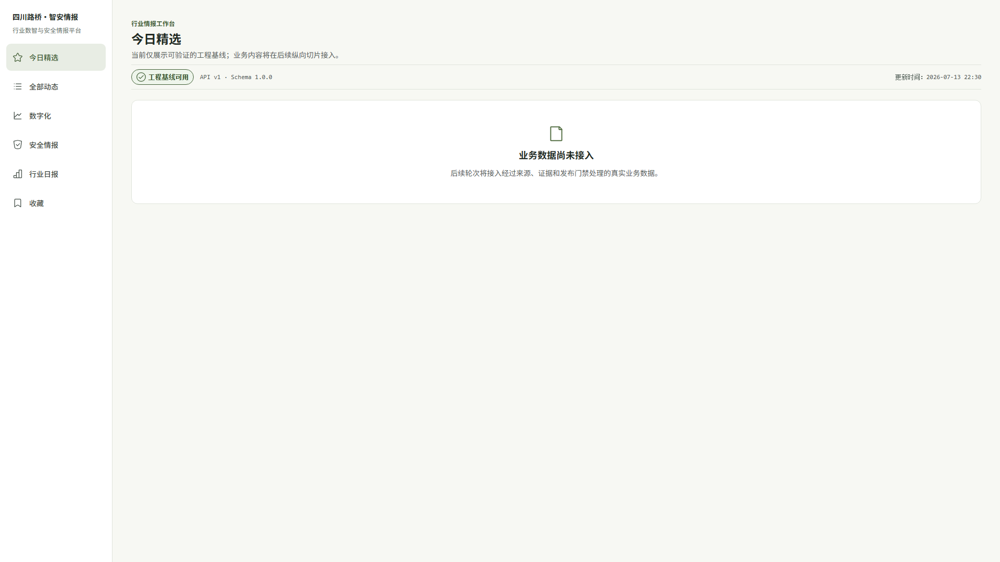
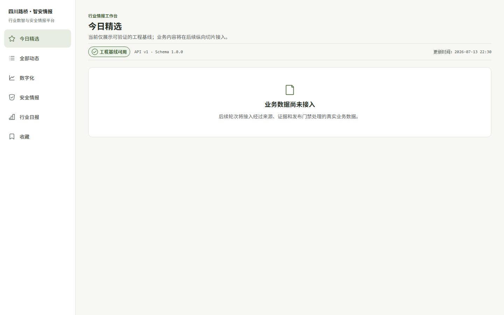
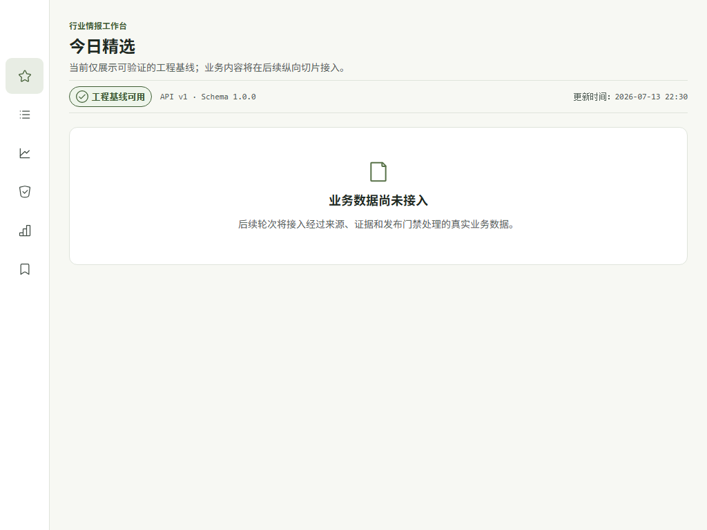
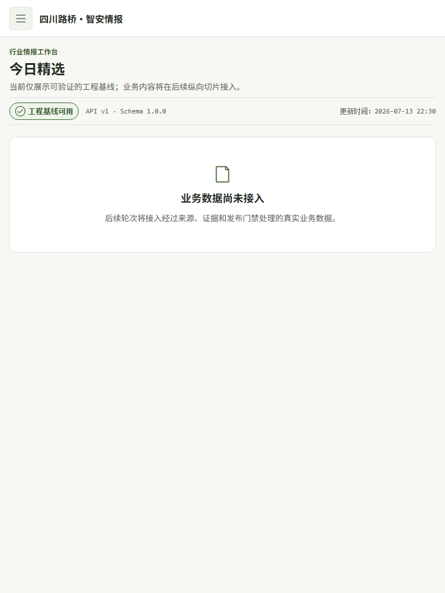

# Round 00A 方案1设计系统与应用壳层验收记录

- 日期：2026-07-13
- 分支：`codex/round-00a-ui-foundation`
- 实现与测试顶端提交：`0dee1f2`
- 最终验收资料提交：见本轮最终回执；本文件不预填尚未生成的提交哈希

## 用户价值

用户进入平台即可获得统一的“四川路桥·智安情报”应用壳层、频道导航、页面标题、真实 API/Schema 工程状态和诚实空态。后续轮次可在同一套低饱和牛油果视觉、可访问原语与响应式基线上增量接入真实情报，不需要为每个频道重复搭建页面。

## 验收场景与范围

本轮验收覆盖根路由健康状态与真实空态、共享频道壳层、桌面/紧凑侧栏/移动抽屉、SPA 导航、键盘焦点、reduced-motion、强制色、200% 阅读基线、axe 扫描与四断点视觉回归。主页只展示从真实版本接口取得的 `API v1 · Schema 1.0.0`，没有业务卡片、演示评分或看似真实的行业新闻。

正式页面复用 `AppShell` 和同一个 `IntelligenceFeedPage`。`/`、`/selected`、`/all`、`/digital`、`/safety` 以及当前空态阶段的 `/daily`、`/saved` 均沿用该壳层；管理入口仅受上层显式 `showAdmin` 布尔值控制，当前因权限系统尚未接入而保持隐藏。本轮未创建 `TimelineFeed`、`IntelligenceCard`、`FeedPage`、`ItemSummary` 或 `PublicationService`，也未实现数据库、业务 API、采集、AI、审核、发布、真实搜索、收藏持久化或后台管理业务。

## 设计系统与组件边界

- `docs/codex-kit/assets/ui/design_tokens.json` 仍是颜色、字体、间距、圆角、阴影、布局、断点、动效与图标参数的单一权威；生成的类型安全 Token 和 CSS 变量供 `@srbg/ui`、Tailwind 与 Nuxt UI 4 使用。
- 正式前端继续使用 Nuxt 4、Vue 3、TypeScript strict、Tailwind CSS 与 Nuxt UI 4，没有引入 React 或第二套全量组件库。
- 图标统一通过 `AppIcon` 封装 Iconoir；正式 Logo 尚未提供，当前使用文字锁定稿，没有复制 AIHOT 品牌素材或生成仿冒 Logo。
- 组件清单现有 23 项：C001—C005 与新增 C019—C023 标记为 `implemented-00A`；C006—C018 保持 `planned`，避免把未来业务组件误记为已经实现。

## 路由、响应式与无障碍

- `/` 与 `/selected` 共享“今日精选”当前态；频道链接使用 Nuxt SPA 导航，往返后不发生整页文档导航。
- 1920px 与 1440px 使用 216px 完整侧栏；1439px 与 1280px 使用 200px 侧栏；1279px 至 1024px 使用 72px 紧凑侧栏；1023px 及以下切换移动页头与抽屉导航。
- 跳过链接是首个键盘停靠点，可将焦点移至 `main`；当前导航使用 `aria-current="page"`。
- 移动抽屉支持初始焦点、Tab/Shift+Tab 闭环、Esc 关闭、滚动锁和触发器焦点归还；焦点陷阱过滤隐藏、禁用及不可达元素。
- 状态由文字、图标与颜色共同表达；强制色下保留可见焦点和状态图标；非必要动画响应 `prefers-reduced-motion`。
- 720×450 等效 200% 阅读视口仍可到达主内容与移动导航；根页面和打开抽屉后的 axe 结果均为 `violations=[]`。

## 截图证据

以下 PNG 均由仓库 Playwright 1.61.1 / Chromium 从健康的 `http://127.0.0.1:3000/` 直接生成。每次采集均设置精确 viewport、light 色彩模式和 reduced motion，等待 `.srbg-app-shell[aria-busy="false"]` 与真实 API/Schema 文本后截取当前 viewport；脚本同时确认页面横向溢出为 0、`article` 为 0、演示指标为 0。四张图片均已实际目视检查，无裁切、重叠、错误覆盖层或伪业务数据。

### 1920×1080

### 1440×900

### 1024×768

### 768×1024

## 最终真实测试输出

以下结果来自 2026-07-13 本轮验收资料落盘后的最终刷新；实现与浏览器测试顶端提交为 `0dee1f2`，最终交付哈希由本轮回执给出。首次调用 Token 脚本时，Codex 桌面 PowerShell 的 `PATH` 未包含其已安装的 Node 目录；补入桌面提供的 Node 24.14.0 运行时路径后，从 `pnpm install --frozen-lockfile` 开始完整重跑，仓库文件无需因此修改。

| 检查 | 实际结果 |
|---|---|
| `pnpm install --frozen-lockfile` | 退出码 0，lockfile 未变化 |
| `pnpm --filter @srbg/ui tokens:check` | 退出码 0，生成物与 `design_tokens.json` 一致 |
| `pnpm --filter @srbg/web build` | Nuxt 生产构建退出码 0 |
| Ruff / mypy strict | 退出码 0；mypy 检查 11 个源文件无问题 |
| Python pytest | 38 项测试通过 |
| `@srbg/ui` Vitest | 12 个测试文件、50 项测试通过 |
| `@srbg/web` Vitest | 23 项测试通过 |
| 契约测试 | 8 项测试通过，生成契约无漂移 |
| `make security-check` | 退出码 0；pip-audit 无已知漏洞，pnpm 仅 1 个低危项，Trivy 无 HIGH/CRITICAL 机密或配置发现 |
| Playwright E2E | 20 项测试通过 |
| axe | 根页面与打开移动抽屉 2 个场景通过，均断言 `violations=[]` |
| 视觉回归 | 1920×1080、1440×900、1024×768、768×1024 共 4 项通过 |
| `make smoke resilience-test` | 退出码 0；健康栈通过，Redis 停机时 readiness 正确降级并完成恢复 |

最终运行中观察到 Nuxt module-preload sourcemap、VueUse PURE 注释位置、`@iconify` 触发的 Node DEP0155 弃用，以及 Playwright 对同时设置 `NO_COLOR`/`FORCE_COLOR` 的提示。它们均来自上游工具链，相关命令退出码为 0。

## 数据迁移与回滚

本轮没有数据库或 Alembic 迁移，也没有后端状态变更。若需要回滚，在工作区干净时按本轮提交逆序使用 `git revert`，包括最终回执中的验收资料提交，即可保留 Round 00 基线并撤销 Round 00A；不需要执行数据库降级命令。

## 已知限制与 Round 01 门禁

- 真实业务数据、企业 SSO、完整管理后台、`TimelineFeed`、`IntelligenceCard`、详情、证据、审核和发布能力均在后续轮次实现。
- 四川路桥正式 Logo 与授权品牌素材仍待提供，当前文字锁定稿仅用于开发。
- CSP nonce/hash 收紧留待后续安全加固，当前不将其描述为生产完成状态。
- Playwright 视觉回归为兼容跨平台字体与渲染差异设置 `maxDiffPixelRatio: 0.03`，仍保留逐图人工检查。
- Round 00A 授权范围与全部最终门禁均已完成，满足进入 Round 01 的工程门禁；上述后续业务能力和安全加固仍按各自轮次继续实施。
