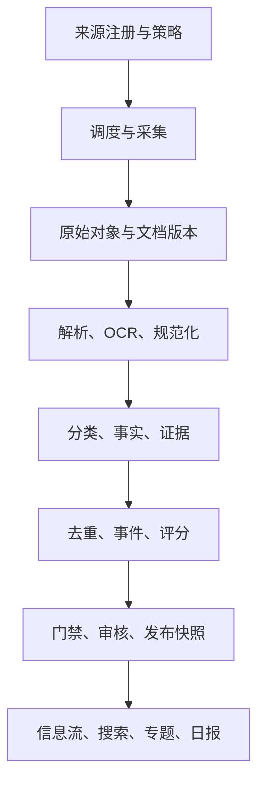
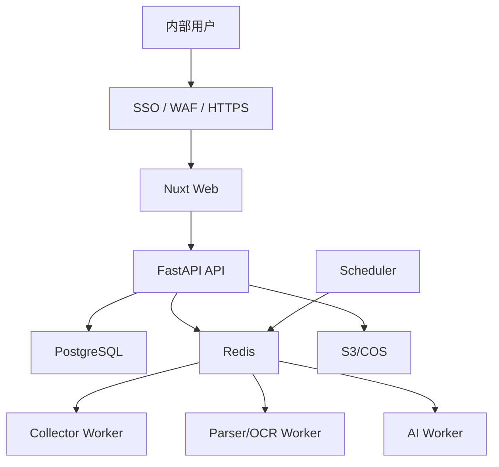

# 03｜技术架构与数据设计

## 1. 规模假设

- 30—80 个高价值来源；
- 每日新增 500—5,000 份文档；
- 100—500 名内部用户；
- 采集与处理自动化，高风险内容人工审核；
- 单区域部署，RPO 15 分钟，RTO 4 小时。

达到每日 5 万份文档、搜索持续不达标、多团队独立发布或单体相互阻塞之前，不拆微服务、不引入 Kafka、OpenSearch、图数据库或 Kubernetes。

## 2. 逻辑架构



## 3. 运行进程

- `web`：Nuxt 用户端和管理端；
- `api`：FastAPI API 与领域服务；
- `scheduler`：唯一调度主节点；
- `collector-worker`：发现、下载、附件处理；
- `parser-worker`：HTML/PDF/OCR 与版本差异；
- `ai-worker`：分类、抽取、摘要、候选聚类；
- `maintenance-worker`：索引、日报、质量抽检和清理。

这些进程共享一个后端代码库和数据库，但使用不同权限、队列和资源限制。

## 4. Monorepo 目标结构

```text
.
├── apps/
│   ├── web/
│   ├── api/
│   └── worker/
├── packages/
│   ├── contracts/
│   ├── test-fixtures/
│   └── ui/
├── infra/
│   ├── compose/
│   ├── migrations/
│   ├── monitoring/
│   └── scripts/
├── docs/
├── tests/
│   ├── contract/
│   ├── e2e/
│   ├── fixtures/
│   └── quality/
├── AGENTS.md
├── Makefile
└── CHANGELOG.md
```

## 5. 后端模块边界

| 模块 | 职责 |
|---|---|
| `iam` | 用户、部门、角色、SSO、数据范围 |
| `source_registry` | 来源、合规、频率、连接器配置 |
| `ingestion` | 调度、发现、下载、游标、重试 |
| `document_vault` | 原始对象、文档、版本、附件、哈希 |
| `parsing` | HTML/PDF/OCR、正文块、元数据 |
| `taxonomy` | 分类、标签、地区、场景和同义词 |
| `intelligence` | 情报条目、实体、事实、证据、类型化字段 |
| `events` | 事件、关系、聚类和生命周期 |
| `ai_pipeline` | 模型网关、Prompt、Schema、调用和评测 |
| `scoring` | 相关性、权威性、影响、证据、置信和热度 |
| `editorial` | 门禁、审核、纠错、撤回、发布修订 |
| `discovery` | 信息流、搜索、热点和相关内容 |
| `reports` | 收藏、专题、日报和导出 |
| `operations` | 来源健康、失败队列、质量和告警 |
| `audit` | 只追加的操作和发布审计 |

跨模块不得直接写对方 ORM 表。同步调用通过应用服务接口；异步副作用通过事务 Outbox 进入任务队列。

`editorial` 必须对外只暴露一个服务端 `PublicationService`。审核、发布、修订、撤回、重发、搜索索引和日报快照均以它的决策为入口；服务在事务内重新读取来源策略、当前文档版本、已接受 Claim/Evidence、风险、安全处置和审核记录，并执行 `docs/codex-kit/assets/validation/publication_gate.json`。客户端、模型、管理员按钮和 Worker 传入的同名字段均不具有授权性。

数据库使用独立发布角色：只有 `PublicationService` 的专用连接可写 `publication` 与 `publication_revision`，常规 API、AI Worker、采集 Worker 和管理员连接仅能通过服务接口请求发布。这样即使出现漏接的 API 或脚本，数据库层仍会拒绝绕过门禁的直接写入。

## 6. 核心数据表

### 来源与采集

- `source`：名称、类型、基础 URL、权威等级、地域、内容范围、状态；
- `source_policy`：robots、条款、版权、存储、发布、限速、审查时间；
- `source_connector`：连接器、解析器、计划、非敏感配置、密钥引用；
- `source_checkpoint`：游标、外部 ID、最后成功；
- `fetch_run`：批次、状态、数量、错误；
- `fetch_record`：请求/最终 URL、状态、ETag、Last-Modified；
- `raw_object`：对象键、MIME、字节数、SHA-256、响应头。

### 文档与处理

- `document`：来源、外部 ID、规范 URL、种类、生命周期；
- `document_version`：版本号、原始对象、标题、正文块、发布时间、内容哈希；
- `document_attachment`：附件与父附件；
- `version_change`：前后版本、变化类型、差异、是否实质变化；
- `processing_run`：阶段、代码/配置/模型/提示词版本、输入哈希、输出和成本。

### 情报、事实与事件

- `intelligence_item`、各类型 profile 表；
- `item_document`、`taxonomy_term`、`item_taxonomy`；
- `entity`、`item_entity`；
- `claim`、`claim_evidence`、`claim_conflict`、`field_provenance`；
- `event`、`event_item`、`event_relation`；
- `topic_cluster`、`topic_event`。

### 审核、发布与用户

- `review_task`、`review_decision`；
- `publication`、`publication_revision`；
- `saved_item`、`collection`、`report`；
- `feedback`、`audit_log`、`outbox_event`。

数据库详细字段以实施期 Alembic 迁移为写入契约；`docs/codex-kit/assets/content.schema.json` 仅定义已发布只读模型。AI 各步骤写入候选使用 `docs/codex-kit/assets/schemas/` 的独立契约，核心枚举在 `packages/contracts` 单点定义。

## 7. 连接器与解析器接口

```python
class SourceConnector(Protocol):
    connector_key: str

    async def discover(
        self,
        checkpoint: dict | None,
        since: datetime | None,
    ) -> DiscoveryPage: ...

    async def fetch(
        self,
        ref: DiscoveredRef,
        conditional: ConditionalRequest | None,
    ) -> FetchResult: ...

    async def healthcheck(self) -> HealthResult: ...
```

```python
class DocumentParser(Protocol):
    parser_key: str

    def supports(self, mime_type: str, source_id: UUID) -> bool: ...

    async def parse(self, raw: RawObjectRef) -> ParsedDocument: ...
```

采集器只负责发现和取得原始字节，不做行业分类；解析器只负责正文和版面，不做发布判断。

每个连接器必须具备：

- 离线固定样本和契约测试；
- 幂等键、游标续跑和条件请求；
- 超时、退避、重试、熔断和来源级限速；
- 域名/附件域名白名单和 SSRF 防护；
- 结构异常时显式失败，禁止空正文“成功”。

## 8. API 契约

### 门户

- `GET /api/v1/feed?mode=selected|all`
- `GET /api/v1/items/{id}`
- `GET /api/v1/events/{id}`
- `GET /api/v1/hot-topics`
- `GET /api/v1/daily`
- `GET /api/v1/reports/{id}`
- `GET /api/v1/search`
- `GET /api/v1/taxonomies`
- `GET /api/v1/fingerprint`
- `GET /api/v1/version`

### 用户

- `GET /api/v1/me`
- `GET|POST|DELETE /api/v1/saved-items`
- `GET|POST|PATCH /api/v1/collections`
- `POST /api/v1/feedback`
- `GET /api/v1/export/markdown`

### 管理

- `/api/v1/admin/sources`
- `/api/v1/admin/sources/{id}/test`
- `/api/v1/admin/fetch-runs`
- `/api/v1/admin/failures`
- `/api/v1/admin/review-queue`
- `/api/v1/admin/items/{id}/submit|approve|reject|correct|withdraw`
- `/api/v1/admin/events/{id}/merge|split`
- `/api/v1/admin/conflicts`
- `/api/v1/admin/quality`
- `/api/v1/admin/audit-logs`

列表使用 Cursor 分页；写操作接受 `Idempotency-Key`；读接口支持 ETag；错误使用 RFC 9457 Problem Details。

## 9. 搜索设计

MVP 使用 PostgreSQL：

- 编号、文号、标准号、DOI 走规范化精确索引；
- 标题、实体、标签走 `pg_trgm`；
- 正文在应用侧中文分词后建立 GIN 索引；
- 可选 `pgvector` 用于语义召回、近似重复候选和相关内容；
- 排序同时考虑文本相关性、内容相关性、权威、证据和时效；
- ACL 条件必须进入数据库查询，不允许检索后再前端过滤。

## 10. 幂等与一致性

- 发现幂等键：`source_id + external_id`，无外部 ID 时使用规范 URL；
- 原始对象唯一键：SHA-256；
- 文档版本唯一键：`document_id + content_hash`；
- AI处理唯一键：`stage + input_hash + code/config/model/prompt version`；
- 发布版本单调递增；
- 任务按至少执行一次设计，业务写入必须幂等；
- 数据库事务与异步任务之间使用 Outbox；
- Redis 丢失不能造成业务事实丢失，任务可从数据库重建。

## 11. 部署拓扑



网络隔离：

- API 区只暴露 HTTPS；
- PostgreSQL/Redis 无公网；
- 采集 Worker 有受控公网出口但不能访问管理网；
- AI Worker 只访问模型网关；
- 管理后台仅企业 SSO/VPN/可信网络；
- 开发、测试、预生产、生产分离。

## 12. 可观测性

统一记录：

- 请求 ID、任务 ID、来源 ID、文档版本 ID；
- 采集发现数、变更数、空正文率、解析失败率；
- 队列深度、任务延迟、重试和死信；
- AI Schema 通过率、证据覆盖、成本和耗时；
- 审核积压、撤回、纠错和发布门禁失败；
- API 延迟、错误率、搜索零结果率；
- 数据库、Redis、对象存储和备份状态。

正文、Cookie、令牌和个人敏感信息不得写入日志。
